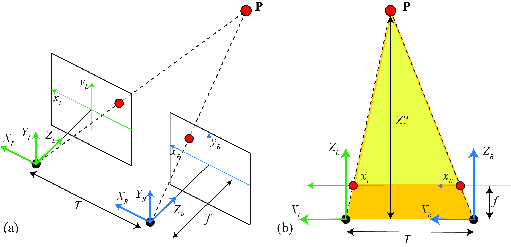
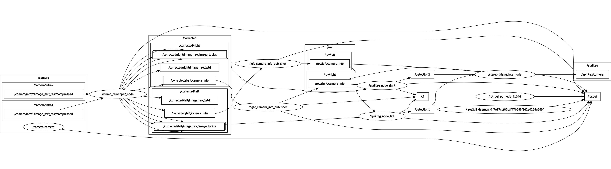

# DU Perception AprilTag Triangulation
Underwater Stereo AprilTag detection and 3D triangulation pipeline for the ROV using stereo camera

## How it works

The triangulation is based on stereo geometry — two cameras observe the same point and from the disparity between the two image coordinates, we can recover the 3D position. I referenced this concept from [MIT Vision Book — 3D Scene Understanding: Stereo](https://visionbook.mit.edu/3d_scene_understanding_stereo.html) which explains the geometry clearly.



The full ROS2 pipeline looks like this:



## What's in here
- `apriltag_msgs` / `apriltag_ros` — AprilTag detection
- `pinax_camera_model_jazzy` — underwater image correction (Pinax model)
- `rov_vision` — camera info publisher + stereo triangulator node

## Requirements
- Ubuntu 24.04
- ROS2 Jazzy
- Intel RealSense stereo camera

Install ROS2 deps:
```bash
sudo apt install ros-jazzy-desktop ros-jazzy-realsense2-camera \
  ros-jazzy-tf2 ros-jazzy-tf2-ros ros-jazzy-tf2-geometry-msgs \
  ros-jazzy-message-filters ros-jazzy-camera-info-manager \
  python3-rosdep colcon-common-extensions
```

## Build
```bash
cd ~/your_ws

# clone this repo into src/
git clone https://github.com/DEEP-UNDER-ROV/DU_Perception_Apriltag_Triangulate.git src/rov_perception

# install deps
rosdep install --from-paths src --ignore-src -r -y

# build
colcon build
source install/setup.zsh
```

## Launch
Plug in the RealSense then:
```bash
ros2 launch rov_vision uw_rs_apriltag_triangulation.launch.xml
```

Optional args:
```bash
ros2 launch rov_vision uw_rs_apriltag_triangulation.launch.xml \
  tag_family:=36h11 \
  tag_size:=0.1 \
  serial_no:=_12345678
```

## Output

| Topic | Type | Description |
|---|---|---|
| `/apriltag/corners` | `PolygonStamped` | 4 corners per tag |
| `/detection1` | `AprilTagDetectionArray` | left camera detections |
| `/detection2` | `AprilTagDetectionArray` | right camera detections |
| `/rov/left/camera_info` | `CameraInfo` | calibrated left camera info |
| `/rov/right/camera_info` | `CameraInfo` | calibrated right camera info |

## Quick check
```bash
# all nodes running?
ros2 node list

# getting corners?
ros2 topic echo /apriltag/corners

# check depth is reasonable (~0.5m if tag is 0.5m away)
ros2 topic echo /apriltag/corners | grep "z:"
```

## Reference
- [MIT Vision Book — 3D Scene Understanding: Stereo](https://visionbook.mit.edu/3d_scene_understanding_stereo.html)
